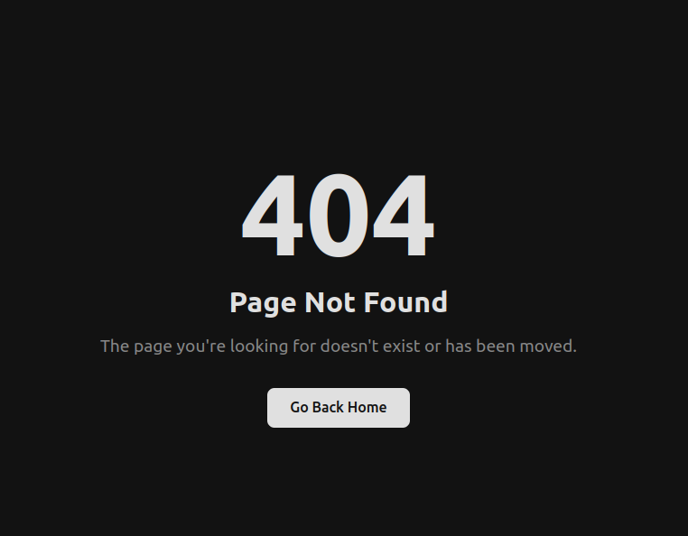

# Default Backend

[](https://github.com/meysam81/default-backend)
[](https://github.com/meysam81/default-backend)
[](https://github.com/meysam81/default-backend)
[](https://hub.docker.com/r/meysam81/default-backend)
[](https://sonarcloud.io/summary/new_code?id=meysam81_default-backend)
[](https://sonarcloud.io/summary/new_code?id=meysam81_default-backend)
[](https://sonarcloud.io/summary/new_code?id=meysam81_default-backend)
[](https://sonarcloud.io/summary/new_code?id=meysam81_default-backend)
[](https://sonarcloud.io/summary/new_code?id=meysam81_default-backend)
[](https://sonarcloud.io/summary/new_code?id=meysam81_default-backend)
[](https://sonarcloud.io/summary/new_code?id=meysam81_default-backend)
[](https://sonarcloud.io/summary/new_code?id=meysam81_default-backend)
[](https://sonarcloud.io/summary/new_code?id=meysam81_default-backend)

<!-- START doctoc generated TOC please keep comment here to allow auto update -->
<!-- DON'T EDIT THIS SECTION, INSTEAD RE-RUN doctoc TO UPDATE -->

- [Default Backend](#default-backend)
  - [Overview](#overview)
  - [How to Run?](#how-to-run)
  - [Visual](#visual)

<!-- END doctoc generated TOC please keep comment here to allow auto update -->

## Overview

This is a simple one-page HTML docker image repository that will serve as the
default backend, usually useful for the default rule of any load balancer.

## How to Run?

```bash
docker run -d -p 8080:80 --name default-backend meysam81/default-backend
```

## Visual

The page looks like below:


